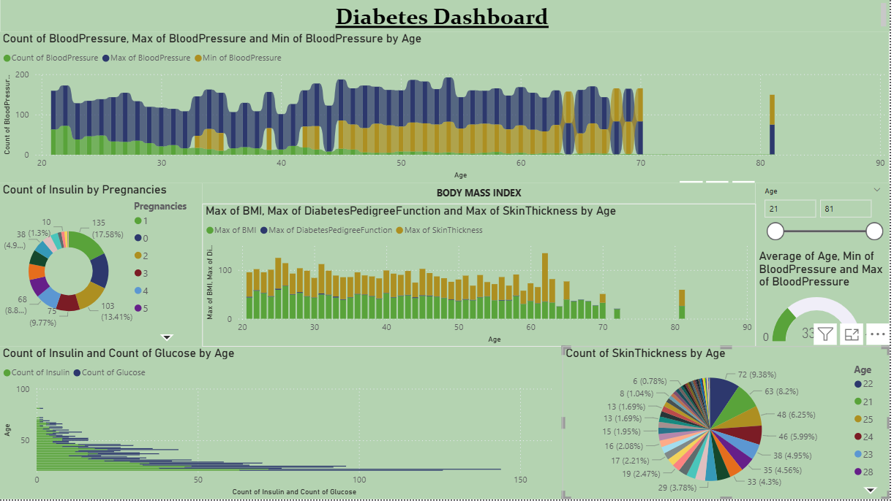

# Diabetes and Heart Analysis and Prediction

## 📌 Project Overview
This project aims to predict and analyze the probability of heart disease or diabetes-related health issues by leveraging medical datasets and machine learning techniques.  
The system applies various algorithms, evaluates their performance, and uses data visualization to identify key risk factors.

---

## 🛠 Technologies Used
- **Languages:** Python
- **Libraries & Frameworks:** Pandas, NumPy, Matplotlib, Seaborn, Scikit-learn
- **Tools:** Jupyter Notebook, Power BI
- **Data Visualization:** Power BI, Histograms, Scatter Plots, Heatmaps
- **Dataset:** Pima Indian Diabetes Dataset (and other relevant medical datasets)

---

## 📂 Features
- **Data Preprocessing:** Cleansing, handling missing values, and preparing datasets for modeling.
- **Exploratory Data Analysis (EDA):** Visualization of patterns and correlations between health parameters.
- **Machine Learning Models:** Logistic Regression, Decision Trees, Random Forest, SVM, and others.
- **Model Evaluation:** Accuracy, Precision, Recall, F1-score, and Confusion Matrix.
- **Prediction:** User health data input to predict diabetes or heart disease probability.

---

## 📊 Dataset Details
- **Source:** [Pima Indian Diabetes Dataset](https://www.kaggle.com/datasets/uciml/pima-indians-diabetes-database)  
- Attributes include: Pregnancies, Glucose, Blood Pressure, Skin Thickness, Insulin, BMI, Age, etc.

---

## 📈 Power BI Visualization

The project also includes an **interactive dashboard** created in **Power BI** for insightful data visualization.

### Dashboard Preview:


You can explore the interactive version here: **[Power BI Report Link](https://app.powerbi.com/)** *(Replace this link with your actual published report link)*

**Key Insights:**
- Distribution of key health parameters (Glucose, BMI, Age, etc.).
- Correlation between different factors and diabetes/heart disease.
- High-risk demographic analysis.

---

## 🚀 How to Run
1. Clone the repository:
   ```bash
   git clone https://github.com/AryanMevada/Diabetes-and-Heart-Analysis-and-Prediction.git
